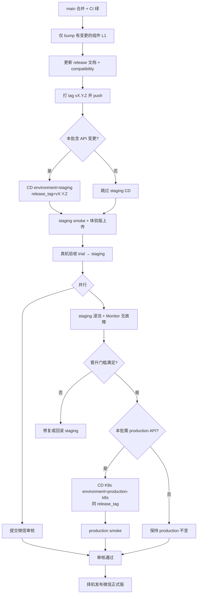

# Staging → Production 发布晋升策略

日期：2026-06-14  
状态：**策略文档（已采纳）**；**自动化门禁尚未实现**，当前按本手册人工执行。

关联：[release-runbook.md](../release-runbook.md)、[versioning.md](./versioning.md)、[env/README.md](../env/README.md)、[ci-cd.md](../ci-cd.md)。

---

## 目标

在用户量增长前，把「先预发布、再生产」固化为默认发布路径，降低 API 与小程序联调失误、生产误发布和回滚成本。

核心原则：

1. **同一 Git `release_tag` 先上 staging，达标后再上 production**（API 有变更时）。
2. **小程序体验版 / 手机预览 / 真机调试** 连 staging；**正式版** 连 production。
3. **微信提审可与 staging 验收并行**；正式版发布时机与 production API 就绪对齐。
4. **production 晋升** 在未来由 CI 门禁强制执行；当前为人工 checklist。

---

## 环境与小程序映射

| 运行时 | API 基址                         | 微信小程序 `envVersion`              | 典型入口                  |
| ------ | -------------------------------- | ------------------------------------ | ------------------------- |
| 本地   | `http://127.0.0.1:3100`          | `develop` + 模拟器                   | 开发者工具                |
| 预发布 | `https://staging.xingxiaolin.cn` | `trial`（体验版）或 `develop` + 真机 | 体验版扫码、预览/真机调试 |
| 生产   | `https://xingxiaolin.cn`         | `release`（正式版）                  | 已发布正式版              |

GitHub CD：staging 走 Compose `CD` workflow 的 `environment: staging`；production 走 `CD (K8s)` workflow 的 GitHub Environment `production-k8s`。两者各自独立 `DEPLOY_*` 与 `CD_PUBLIC_API_URL`。详见 [env/README.md](../env/README.md)。

---

## 两条发布线

| 组件           | 发布方式                                    | 与另一组件的关系                                               |
| -------------- | ------------------------------------------- | -------------------------------------------------------------- |
| **API**        | 手动 CD（staging Compose → production K8s） | 体验版验收依赖 staging API；正式版依赖 production API          |
| **微信小程序** | 开发者工具上传 → 体验版 / 提审 / 正式发布   | L1 版本号独立；兼容性见 [compatibility.md](./compatibility.md) |

**不必**每次都在同一分钟同时点「production K8s CD」和「微信正式发布」，但**正式发布小程序前**须保证 production API 与客户端组合已在 [compatibility.md](./compatibility.md) 中验证或记录。

---

## 标准发布流程（推荐）



### 步骤说明

1. **开发与门禁**：`pnpm test:api`、`pnpm check:wechat` 等通过；仅 bump 有改动的组件 L1。
2. **打 tag**：`vX.Y.Z` 为 CD 的 `release_tag`，与 `GET /v1/health` 的 `releaseTag` 一致。
3. **Staging CD（API 有变更时必做）**：GitHub Actions → CD → `environment=staging`，填写同一 `release_tag`。
4. **小程序体验版**：上传 miniapp L1；体验版 / 预览 / 真机调试连 staging 验收。
5. **提审（可提前）**：审核周期与 staging 浸泡并行，不必等 production。
6. **晋升门槛**（见下节）：满足后再触发 **CD (K8s) / production-k8s**（若本批需要）。
7. **正式发布**：微信审核通过后，在合适窗口发布正式版（连 production）。

---

## 按变更类型的策略

| 变更类型                 | Staging CD（Compose） | 体验版 / 提审                                  | Production CD（K8s） | 微信正式版            |
| ------------------------ | --------------------- | ---------------------------------------------- | -------------------- | --------------------- |
| **仅小程序**（API 兼容） | 可选                  | 上传 + smoke                                   | 通常 **不需要**      | 审核通过后发布        |
| **仅 API**（向后兼容）   | **必须**              | 可不更新                                       | staging 达标后       | —                     |
| **API + 小程序**         | **必须**              | 同 tag 体验版                                  | staging 达标后       | 审核通过 + API 已就绪 |
| **破坏性 API / 迁移**    | **必须** + 延长浸泡   | 体验版与 production 版本组合写入 compatibility | 达标 + 迁移策略确认  | 与 API 同步发布       |

示例：**v0.8.2** 仅小程序（多环境登录）→ 打 tag、上传体验版/提审即可，**无需**为 0.8.2 单独跑 production K8s CD。

---

## Production 晋升门槛（当前：人工）

在触发 `CD (K8s)` / `production-k8s` 之前，发布负责人应确认：

| #   | 门槛                                  | 建议默认                                                     | 当前执行方式                         |
| --- | ------------------------------------- | ------------------------------------------------------------ | ------------------------------------ |
| 1   | Staging 已部署 **同一 `release_tag`** | 必须（API 有变更时）                                         | 人工核对 `curl staging.../v1/health` |
| 2   | 浸泡时间                              | **≥ 24 小时**（或至少覆盖一个完整日活周期）                  | 人工记录部署时间                     |
| 3   | 监控无故障                            | 浸泡期内 Monitor(staging) 无失败；关键 smoke 通过            | 人工查看 Actions / artifact          |
| 4   | 小程序 smoke                          | 体验版四 Tab、微信登录、本批改动点                           | 人工真机                             |
| 5   | 数据库迁移                            | staging Compose 验证；production K8s 显式 migration workflow | 人工 + `/v1/health/db`               |
| 6   | 兼容性                                | [compatibility.md](./compatibility.md) 已更新                | 人工                                 |

内测阶段可将 #2、#3 酌情缩短；**用户量显著增长后应严格执行**。

### 晋升核对命令（示例）

```bash
# Staging 身份
curl -sS https://staging.xingxiaolin.cn/v1/health | jq '.data | {environment, releaseTag, apiVersion, gitSha}'
curl -sS https://staging.xingxiaolin.cn/v1/health/db | jq '.data.status'

# Production（晋升后）
curl -sS https://xingxiaolin.cn/v1/health | jq '.data | {environment, releaseTag, apiVersion, gitSha}'
```

---

## 微信小程序与审核

### 推荐顺序

1. Staging API 就绪（若本批含 API）。
2. 上传小程序 → **体验版**（`trial` → staging）→ 真机 smoke。
3. **提交审核**（可与 staging 浸泡并行）。
4. Production API 晋升（若需要）。
5. **审核通过后** 发布正式版（`release` → production）。

### 注意

- 提审**不强制** production 已部署同 tag；但**正式发布**前 production 须与正式版小程序兼容。
- 公众平台 **request 合法域名** 须同时包含 `staging.xingxiaolin.cn` 与 `xingxiaolin.cn`（或对应纯域名形式）。
- 仅小程序变更且 production API 未变时，可先提审，审核通过即发布正式版。

---

## 未来自动化（待实现）

以下能力**尚未**写入 CD workflow，计划在后续版本（如 v0.9 前运维迭代）实现：

| 能力                        | 说明                                                            |
| --------------------------- | --------------------------------------------------------------- |
| **Production CD 前置检查**  | production job 启动前校验 staging 同 tag、部署时间 ≥ 可配置阈值 |
| **Monitor 门禁**            | 要求最近 N 次 `Monitor`（staging）成功才允许 production K8s CD  |
| **可选 smoke PAT**          | staging 上 `CD_SMOKE_PAT` 黑盒通过作为晋升条件                  |
| **GitHub Environment 保护** | production 需审批 + 上述检查 artifact                           |
| **晋升记录**                | CD Summary 输出「staging 部署于 …，浸泡 …h，monitor …」         |

实现前，以本文 **人工 checklist** 为准；不得在文档未更新前假设门禁已生效。

---

## 回滚

- **Staging 失败**：修复后重新 CD staging，或回滚 staging 至旧 `ci_run_id`（见 [release-runbook.md](../release-runbook.md) §七）。
- **Production 失败**：CD 自动回滚或手动 `ci_run_id`；**不**自动回滚 PostgreSQL 已执行迁移。
- **小程序**：正式版回滚走微信公众平台版本管理；体验版可重新上传旧 L1。

---

## 相关文档

- [release-runbook.md](../release-runbook.md) — 操作 checklist
- [versioning.md](./versioning.md) — L1/L2 版本与 tag
- [compatibility.md](./compatibility.md) — 客户端与 API 组合
- [ci-cd.md](../ci-cd.md) — CD workflow 输入与环境
