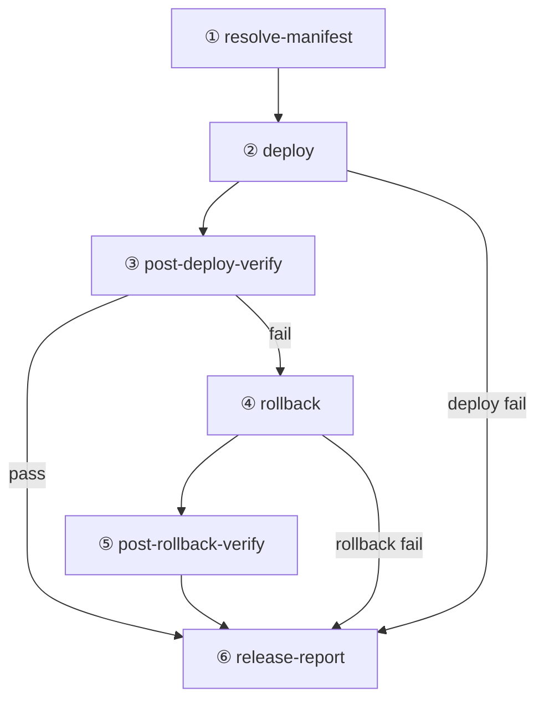

# CD 流水线扩展规划（v0.2.3）

日期：2026-06-04  
关联：[v0.2.3-plan.md](./v0.2.3-plan.md) · [ci-cd.md](../ci-cd.md)

## 目标

在现有「解析 manifest → SSH 部署」之上，把 **发布是否成功** 的判定从「VPS 本机 health」扩展到 **对外可访问的拨测 / 黑盒 / 可选 E2E**，失败则 **自动回滚并复验**，最后 **无论成败都产出发布报告**。

## 现状（2 个 Job）

```text
resolve-manifest   → 校验指纹、导出 git_sha / api_image / ci_run_id
deploy             → SSH：git pull + cd-bootstrap → deploy-from-manifest.sh
```

**已有、但发生在 deploy 的同一 SSH 会话内（步骤 2 里）：**

| 能力 | 位置 | 范围 |
|------|------|------|
| 本机 health/db 轮询 | `deploy-from-manifest.sh` → `wait_for_deployed_api` | `127.0.0.1:${PUBLISH_PORT}` |
| 部署失败或本机 health 失败 → 回滚 | 同脚本 `rollback_previous_deploy` | 用部署**前** `.deploy/current.json` 中的上一版 |
| 写 `.deploy/current.json` | 同脚本 | 记录 gitSha、镜像、ciRunId |

**缺口：**

| 缺口 | 影响 |
|------|------|
| CD workflow 在 SSH 退出 0 后即 **绿**，无后续 Job | 网关/防火墙/公网 URL 异常时仍可能误判成功 |
| 无对外 URL 拨测 | 公网基址（如 `https://xingxiaolin.cn`）与 localhost 不一致时抓不到 |
| 无认证链路黑盒 | DB 迁移后 schema 检查通过，但业务 API 仍可能异常 |
| 回滚仅覆盖「部署中失败」 | **部署已成功写入 current.json 后**，外层测试失败不会触发回滚 |
| 无结构化发布报告 | 只有 Actions 日志，不便归档与对比 |

---

## 目标流水线（6 步逻辑 → 多 Job）

```text
① 解析 manifest          [job: resolve-manifest]     （保持）
② 部署执行               [job: deploy]               （保持入口，见下文职责收窄）
③ 发布后测试             [job: post-deploy-verify]   （新增）
④ 测试失败 → 回滚        [job: rollback]             （新增，条件执行）
⑤ 回滚后测试             [job: post-rollback-verify] （新增，条件执行）
⑥ 发布报告               [job: release-report]       （新增，always）
```



---

## 各步职责

### ① 解析 manifest（不变）

- 解析 `release_tag` / `ci_run_id`
- 下载并 `verify_deploy_manifest.py`
- 上传 `cd-deploy-manifest` artifact 供后续 Job 使用
- **输出**：`git_sha`、`api_image`、`fingerprint`、`ci_run_id`、`release_tag`

### ② 部署执行（调整边界）

**保留：**

- SSH 上传 manifest、`cd-bootstrap.sh`、`deploy-from-manifest.sh` 全链路
- VPS **本机** health/db（L0，启动与迁移就绪，时间短、反馈快）

**建议（实现时二选一，推荐 A）：**

| 方案 | 说明 |
|------|------|
| **A（推荐）** | L0 仍在 VPS；**以 ③ 为发布门禁**；② 成功仅表示「新版本已拉起」 |
| B | ② 仅 `compose up`，L0 移到 ③ 的 runner 通过 SSH 隧道测 localhost | 复杂，暂不采用 |

**部署成功时额外写入（供 ④ 使用）：**

在 `deploy-from-manifest.sh` 成功路径，增加 `.deploy/previous-success.json`（部署**前**快照：`gitSha`、`apiImage`、`apiDigest`、`ciRunId`、`deployMode`）。  
当前仅在失败回滚时用内存中的 `PREVIOUS_*`；成功后会覆盖 `current.json`，导致 **③ 失败后无法从文件恢复上一版**。

### ③ 发布后测试（新增 Job）

在 **GitHub Actions runner** 执行（非 VPS），依赖 Secrets：

| Secret / 变量 | 用途 |
|---------------|------|
| `CD_PUBLIC_API_URL` | 对外基址，如 `https://xingxiaolin.cn`（Environment 级，staging/production 各配） |
| `CD_SMOKE_PAT`（可选） | 只读或最小权限 PAT，跑需鉴权接口 |
| `CD_SMOKE_ENABLED`（可选） | `false` 时仅跑匿名检查（便于 staging 先接入） |

**测试分层（由轻到重，可分期落地）：**

| 层级 | 名称 | 内容 | 本批 P0 |
|------|------|------|---------|
| **L1** | 拨测 / Smoke | `GET /v1/health`、`/v1/health/db`；校验 `apiVersion`、`releaseTag`/`gitSha` 与 manifest 一致；超时 + 重试 | ✅ |
| **L2** | 黑盒 | 脚本化：`GET /v1/today`（带 PAT）、`GET /v1/me`、只读列表各 1 条；HTTP 状态与 JSON `ok` | ✅（有 PAT 时） |
| **L3** | E2E | 复用 `pnpm test:api` 子集，指向 `CD_PUBLIC_API_URL`（独立 marker `post_deploy`）；或 CLI `whoami` + `today --json` | P1 |
| **L4** | 外部拨测 | Cron/ping 厂商、多地域 | 不做 |

**实现落点：**

- `scripts/cd/post-deploy-verify.py`（stdlib + curl 或 httpx 若已在 dev 依赖）
- 输入：manifest 路径、`--base-url`、`--expect-git-sha`、`--pat`（可选）
- 退出码 `0` = 通过，非 `0` = 触发 ④

**与 CI 的关系：** CI 已在 merge 前跑全量 pytest；③ 是 **生产环境、发布 commit、公网 URL** 的窄验收，不重复跑全量。

### ④ 测试失败 → 回滚（新增 Job）

**触发：** `needs: [deploy, post-deploy-verify]`，`if: failure() && needs.deploy.result == 'success'`

**逻辑：**

1. SSH 读取 `.deploy/previous-success.json`（② 写入）
2. 执行新脚本 `apps/api/deploy/rollback-to-previous.sh`：
   - `git reset --hard` 上一 `gitSha`
   - 按上一 `deployMode` pull/build
   - L0 health/db（与现 `rollback_previous_deploy` 同源，可抽公共函数）
3. 更新 `.deploy/current.json` → `status: rolled_back`，并保留 `rolledBackFrom`

**备选（运维手动）：** 用 `workflow_dispatch` + 上一版 `ci_run_id` 再跑一次 CD（文档保留，自动化优先 ④ Job）。

**注意：** 与 [database-migrations.md](../database-migrations.md) 一致——回滚 **不** 撤销已执行的 DB migration；③ 的 L2 应避开破坏性写操作，或以只读接口为主。

### ⑤ 回滚后测试（新增 Job）

**触发：** `needs: rollback`，`if: success()`

**逻辑：** 再次运行与 ③ **相同** 的 `post-deploy-verify.py`（可 `--expect-git-sha` 指上一版），确认线上已回到稳定版本。

失败 → workflow **失败**，`release-report` 标记 `rollback_verify: failed`，需人工介入。

### ⑥ 发布报告（新增 Job）

**触发：** `if: always()`，`needs` 包含 ①～⑤ 中已运行的 Job

**产出：**

| 产物 | 说明 |
|------|------|
| Artifact `cd-release-report` | `release-report.json` + `release-report.md` |
| GitHub Step Summary | 渲染 Markdown 摘要（版本、指纹、各步结论、耗时） |
| （可选）PR / Issue 评论 | 后续再加 |

**`release-report.json` 建议字段：**

```json
{
  "schemaVersion": 1,
  "environment": "production",
  "releaseTag": "v0.2.3",
  "gitSha": "...",
  "fingerprint": "...",
  "ciRunId": "...",
  "outcome": "success | failed | rolled_back",
  "steps": {
    "resolveManifest": "success",
    "deploy": "success",
    "postDeployVerify": "failed",
    "rollback": "success",
    "postRollbackVerify": "success"
  },
  "publicApiUrl": "https://xingxiaolin.cn",
  "verifyDetails": [],
  "finishedAt": "ISO8601"
}
```

生成脚本：`scripts/cd/write-release-report.mjs`（读 `$GITHUB_STEP_SUMMARY` 或各 Job output）。

---

## `.github/workflows/cd.yml` 结构草案

```yaml
jobs:
  resolve-manifest: # 不变

  deploy:
    needs: [resolve-manifest]
    outputs:
      deploy_exit: ${{ steps.deploy_ssh.outcome }}

  post-deploy-verify:
    needs: [resolve-manifest, deploy]
    if: needs.deploy.result == 'success'

  rollback:
    needs: [resolve-manifest, deploy, post-deploy-verify]
    if: failure() && needs.deploy.result == 'success'

  post-rollback-verify:
    needs: [rollback]
    if: needs.rollback.result == 'success'

  release-report:
    needs: [resolve-manifest, deploy, post-deploy-verify, rollback, post-rollback-verify]
    if: always()
```

**最终 workflow 结论：**

| 场景 | workflow 结果 |
|------|----------------|
| ③ 通过 | success |
| ③ 失败、④⑤ 成功 | failure（已回滚，线上旧版） |
| ③ 失败、④ 失败 | failure（需人工） |
| ② 失败 | failure（VPS 内可能已回滚或未变更） |

---

## 实施分期（建议）

| 阶段 | 内容 | 归属版本 |
|------|------|----------|
| **P0** | ③ L1 拨测 + ④ `previous-success.json` + `rollback-to-previous.sh` + ⑥ 报告骨架 | **v0.2.3** |
| **P1** | ③ L2 黑盒（`CD_SMOKE_PAT`）+ ⑤ 与 ③ 共用脚本 | v0.2.3 或 v0.2.4 |
| **P2** | L3 E2E marker + 多环境 staging 先跑通 ③～⑥ | v0.2.4 |
| **P3** | 外部拨测、告警通知（飞书/邮件） | 后续 |

---

## 验收标准（CD 扩展）

- [ ] 故意让 ③ 失败（错误 `expect-git-sha`）时，④ 执行且 `current.json` 为 `rolled_back`
- [ ] ⑤ 对公网 URL 的 L1 通过
- [ ] ⑥ 在成功/失败/回滚三种场景均能下载 `cd-release-report` artifact
- [ ] `docs/ci-cd.md` 更新 Job 图与 Secrets 表
- [ ] staging Environment 先跑通一轮再用于 production

---

## Secrets / 配置增量

| 名称 | 必填 | 说明 |
|------|------|------|
| `CD_PUBLIC_API_URL` | production 建议必填 | 公网 API 基址，用于 ③⑤ |
| `CD_SMOKE_PAT` | 可选 | L2 黑盒 |
| `CD_VERIFY_STRICT_RELEASE_TAG` | 可选，默认 true | health 返回的 `releaseTag` 是否与输入一致 |

现有 `DEPLOY_*` 不变。

---

## 与域名切换的关系

- 拨测 URL 使用 Environment 中的 `CD_PUBLIC_API_URL`（当前生产：`https://xingxiaolin.cn`），**不在 workflow 中硬编码域名**
- 切换域名时只改 GitHub Secret，无需改 workflow 结构

---

## 相关文件（实现时）

| 文件 | 动作 |
|------|------|
| `.github/workflows/cd.yml` | 新增 job、outputs、artifacts |
| `apps/api/deploy/deploy-from-manifest.sh` | 写 `previous-success.json` |
| `apps/api/deploy/rollback-to-previous.sh` | 新建 |
| `scripts/cd/post-deploy-verify.py` | 新建 |
| `scripts/cd/write-release-report.mjs` | 新建 |
| `docs/ci-cd.md` | 同步文档 |
