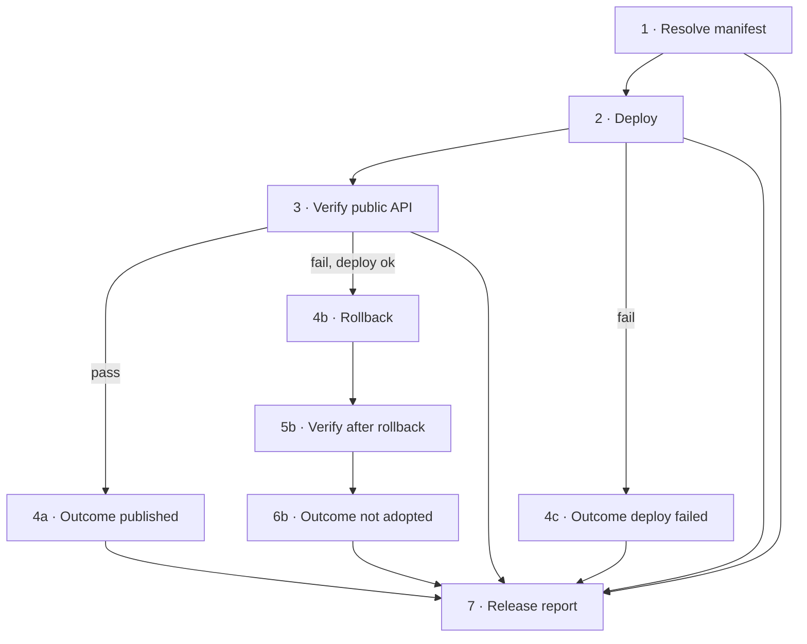

# CD Workflow 可读性重构规划

日期：2026-06-04

## 1. 触发策略（不是临时改动）

| 工作流 | 当前触发 | 是否「自动跑」 | 说明 |
|--------|----------|----------------|------|
| **CI** | `push` / `pull_request` → `main` | **是，一直如此** | 合并到 main 自动构建、测试、发布 `deploy-manifest`；**不是**为 v0.2.3 临时加的 |
| **CD** | **仅** `workflow_dispatch` | **否，不会随 push 自动部署** | 规划始终是：人工 Run workflow + 填 **`release_tag`** |

上次 CD 能跑起来，是因为你要求「请帮我执行」时，用 **`gh workflow run`** 在命令行**手动触发**了一次，并用了 `ci_run_id`（为还没打 `v0.2.3` tag 时的权宜之计）。**没有在 `cd.yml` 里增加 `on: push`。**

### 约定（写入 workflow 顶部注释）

- **日常发布**：只填 `release_tag`（如 `v0.2.3`），`ci_run_id` 留空；tag 须指向已在 main 上 CI 全绿的 commit。
- **`ci_run_id`**：仅回滚、救急、或 tag 尚未打好时的进阶用法；**不作为常规路径宣传**。
- **禁止**未经讨论为 CD 增加 `push`/`workflow_run` 自动触发。

---

## 2. 现状问题：DAG 可读性

GitHub Actions 图里同时出现大量 **Skipped**（rollback、post-rollback-verify），成功路径像「一条线 + 一堆灰块」，不像明确的「成功分支 / 失败分支」。

逻辑上虽是 DAG，但缺少**显式汇合节点**，fork 不清晰。

---

## 3. 目标拓扑（分支式 DAG，仍无环）

原则：

- **主干**：Resolve → Deploy → Verify（所有人都会看到的三步）。
- **成功分支**：Verify 通过 → `publish-accepted`（明确「发布采纳」）。
- **恢复分支**：Verify 失败且 Deploy 已成功 → Rollback → Verify after rollback → `release-not-adopted`。
- **部署失败**：Deploy 失败 → `deploy-failed`（不进入 Verify / Rollback）。
- **汇合**：`release-report` 始终运行，依赖主干 + 各 Outcome job（用 `if: always()`），根据各 job `result` 写报告。

Workflow **整体结论**：

| 场景 | 结论 |
|------|------|
| Verify 通过 | **success**（绿） |
| 已回滚且复验通过 | **failure**（红），但线上为旧版 |
| Deploy 或回滚链失败 | **failure** |

---

## 4. Job 命名对照（实现）

| Job ID（稳定） | 显示名 | 分支 |
|----------------|--------|------|
| `resolve-manifest` | `1 · Resolve manifest` | 主干 |
| `deploy` | `2 · Deploy` | 主干 |
| `post-deploy-verify` | `3 · Verify (public API)` | 主干 |
| `publish-accepted` | `4a · Outcome: published` | 成功 |
| `rollback` | `4b · Rollback` | 恢复 |
| `post-rollback-verify` | `5b · Verify after rollback` | 恢复 |
| `release-not-adopted` | `6b · Outcome: not adopted` | 恢复终点 |
| `deploy-failed` | `4c · Outcome: deploy failed` | 失败 |
| `release-report` | `7 · Release report` | 汇合 |

`post-rollback-verify` 的 `needs` 收窄为仅 `[rollback]`，图上恢复分支更清晰。

---

## 5. 与「填 release_tag」的关系

| 输入 | 用途 |
|------|------|
| `release_tag` **必填（常规）** | 解析 tag → commit → 该 commit 的成功 CI → manifest |
| `ci_run_id` 可选 | 覆盖「按 tag 找 CI」；回滚旧 run、或 tag 未建时用 |
| `environment` | 默认 `production` |
| `deploy_mode` | 默认 `auto` |

Verify 步骤在提供 `release_tag` 时校验 health 中的 `releaseTag` / `gitSha`。

---

## 6. 实施状态

- [x] 规划本文档
- [x] 重构 `.github/workflows/cd.yml`（分支式 Job 名 + Outcome 节点）
- [x] 更新 [ci-cd.md](../ci-cd.md) 拓扑说明
- [ ] 合并后你用 **`release_tag=v0.2.3`** 再跑一轮 CD 验收（tag 打在已验证 commit 上）

---

## 7. 非目标

- CD 自动随 push 触发
- staging 环境（资源紧张，workflow 选项保留但文档标明勿用）
- 将 CD 拆成多个 workflow 文件（除非单文件超过维护上限）
