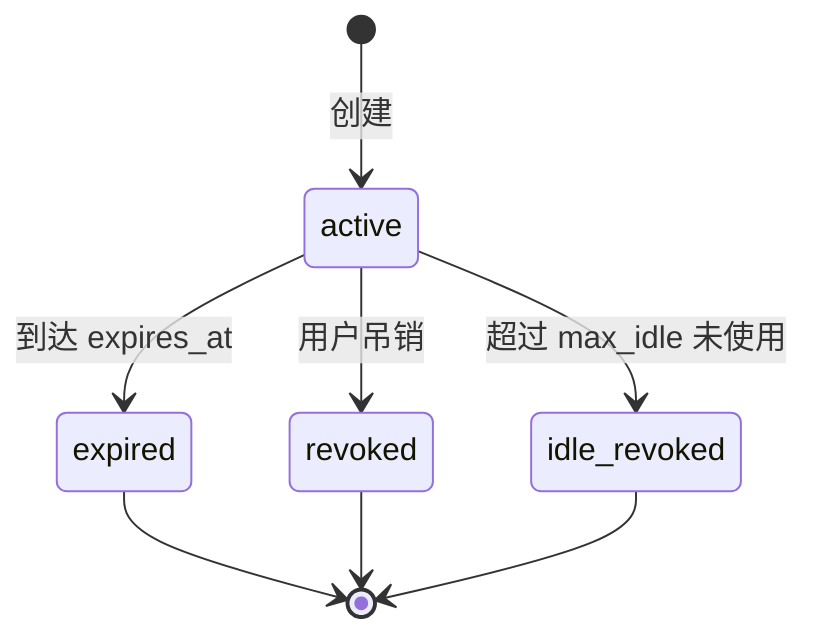

# ai-todo v0.3.0 版本规划 — CLI / 访问令牌生命周期

日期：2026-06-03  
发布目标：内测批次；**暂不强制上传微信小程序**（可与 API/CLI 先行发布）。

## 版本定位

在 **`v0.2.2`**（时区、平台用户名、按用户名建联，见 [v0.2.2-plan.md](./v0.2.2-plan.md)）之后，本批聚焦 **Agent/CLI 访问令牌** 的产品化（创建策略、吊销、列表 UI）。

**安全约定（已确认）**：PAT 明文仍 **仅在创建时显示一次**，不做「随时查看密文」；生命周期与空闲吊销等见下文。

与 `v0.2.2` 的关系：**先交付 0.2.2，再排 0.3.0**；勿与 0.2.2 抢同一发布火车 unless 合并验收。

| 组件 | 目标 L1 | Git tag |
|------|---------|---------|
| API | `0.2.0`（minor：令牌生命周期字段与状态） | `v0.3.0` |
| CLI | `0.3.0`（`token` 子命令） | 同上 |
| 微信小程序 | `0.3.0`（令牌页重构；**上传可选**） | 同上 |

---

## 现状与缺口

### 已有能力

| 层 | 能力 |
|----|------|
| API | `POST/GET/DELETE /v1/api-tokens`、`DELETE revoke-all`；仅存 **SHA-256 哈希**；`expires_at` 创建时可选；`last_used_at` 在鉴权时更新 |
| 小程序 | `settings-agent`：创建（**仅一次**展示明文）、列表名称+日期、吊销 |
| CLI | `ai-todo login --token` / `--issue-pat`；token 存 `~/.ai-todo/settings.json` |

### 与你的诉求对齐

| 诉求 | 现状 | 本批目标 |
|------|------|----------|
| 随时查看密文 | 明文创建后无法恢复（仅 hash） | **维持只显示一次**（不恢复明文） |
| 生命周期：新建、删除、期限、久未使用失效 | 仅有 `expires_at` + 手动吊销 | 补齐 **空闲吊销**、状态展示、创建时可选策略 |
| 布局与 UI | 单页堆叠、强调「只显示一次」 | 状态徽章、生命周期参数、创建后复制 |

---

## 安全设计

### 约束

当前实现与 GitHub PAT 同类：**数据库只存 `token_hash`，明文无法找回**。  
若要「任何时候在小程序查看完整 `aitodo_…`」，必须在服务端**额外保存可恢复密文**（或接受「轮换生成新密钥」代替查看）。

### P0 决策

**显示一次 + 生命周期管理**

1. 创建时返回完整明文，之后服务端不再保存可恢复明文。
2. 鉴权仍只用 `token_hash`。
3. 列表接口增加 `tokenHint`、`status`、`expiresAt`、`maxIdleDays`、`lastUsedAt`。
4. 新建 token 时保存安全提示串，旧 token 无法反推真实后缀时显示通用掩码。

### 备选（P2 或内测反馈后）

| 方案 | 说明 |
|------|------|
| **加密存储 + 登录后揭示** | 服务端保存可恢复密文，增加 `GET /v1/api-tokens/{id}/secret`；需承担服务端密钥和微信账号被盗后的批量泄露风险 |
| **轮换** | 不存明文；「查看」= 生成新 secret 并使旧 hash 失效（CLI 需重新 login） |
| **限时回看** | 密文仅保留 7 天，之后只能轮换 |

---

## 令牌生命周期（产品模型）

### 状态机



| 状态 | 条件 | 用户可见 |
|------|------|----------|
| **有效** | `revoked_at` 空且未过期且未空闲超限 | 绿/默认徽章 |
| **已过期** | `now > expires_at` | 灰；列表可收入「已失效」 |
| **已吊销** | `revoked_at` 非空 | 灰；可选隐藏或折叠 |
| **空闲失效** | `last_used_at` 早于 `now - max_idle_days` | 橙；说明久未使用 |

**实现注意**：`resolve_token` 鉴权时除 `expires_at` 外，增加 **空闲检查**；过期/空闲可懒更新 `revoked_at` 或单独 `status` 字段（推荐懒吊销 + 列表过滤 `revoked_at IS NULL` 时仍要判断过期）。

### 创建参数（扩展 `CreateApiTokenInput`）

| 字段 | 类型 | 默认 | 说明 |
|------|------|------|------|
| `name` | string | 必填 | 如「MacBook CLI」 |
| `expires_at` | ISO datetime? | `null` = 永不过期 | 绝对到期 |
| `max_idle_days` | int? | `90` 或 `null`=不限制 | 多久未使用自动吊销 |
| `scopes` | string[] | 现有默认 | 小程序简化为预设档，高级进 CLI |

**预设档（小程序创建向导）**

| 档位 | expires | max_idle |
|------|---------|----------|
| 短期调试 | +30 天 | 30 天 |
| 日常使用 | +180 天 | 90 天 |
| 长期 | 无 | 90 天 |

### 删除

- 用户操作：**吊销** = 现有 `DELETE /v1/api-tokens/{id}`（软删 `revoked_at`）。
- **全部吊销**：保留 `revoke-all`，入口放在令牌页底部（危险操作二次确认）。

### 自动失效

| 机制 | 触发点 |
|------|--------|
| 绝对到期 | 鉴权失败 + 可选定时任务扫库标记 |
| 空闲吊销 | 鉴权时若 `last_used_at` 超阈则拒绝并写 `revoked_at`；每日 cron 扫一遍补刀 |

配置项（API `settings`）：`pat_default_max_idle_days`、`pat_max_ttl_days`（创建时上限）。

---

## API 变更（P0）

| 方法 | 路径 | 说明 |
|------|------|------|
| POST | `/v1/api-tokens` | 创建：写 hash + token hint；响应带明文（首次复制） |
| GET | `/v1/api-tokens` | 列表：`tokenHint`、`status`、`expiresAt`、`lastUsedAt`、`maxIdleDays` |
| DELETE | `/v1/api-tokens/{id}` | 吊销 |
| DELETE | `/v1/api-tokens/revoke-all` | 保留 |

**迁移**：Alembic 增加 `token_hint`、`max_idle_days`（nullable）。

**版本**：`apps/api` → `0.2.0`；`GET /v1/health` → `apiVersion` 更新。

---

## 微信小程序 UI / 信息架构

### 入口（保持）

「我的」→ **CLI / Agent 接入**（可改名为 **访问令牌**，副标题「电脑端 CLI 与 Agent」）。

### 页面结构（推荐两页，避免单页过长）

```
settings-agent/          # 列表枢纽
settings-token-detail/   # 单令牌详情（query: id）
settings-token-create/   # 新建向导（可选：用 sheet 代替独立页）
```

### 1）列表页 `settings-agent`（重构）

```
┌─────────────────────────────────────┐
│ 说明（1 段）：令牌用于电脑端 CLI；    │
│ 与微信登录分开；可查看状态与吊销。   │
├─────────────────────────────────────┤
│ [ ＋ 新建访问令牌 ]                  │
├─────────────────────────────────────┤
│ 有效令牌 · 2                         │
│ ┌─────────────────────────────────┐ │
│ │ MacBook CLI            [有效]   │ │
│ │ aitodo_•••• 8f3a               │ │
│ │ 创建于 6/1 · 最后使用 昨天       │ │
│ │ 180 天后到期 · 90 天未用失效    │ │
│ │              [复制提示] [详情›] │ │
│ └─────────────────────────────────┘ │
│ ┌─────────────────────────────────┐ │
│ │ Codex Agent            [有效]   │ │
│ │ ...                             │ │
│ └─────────────────────────────────┘ │
├─────────────────────────────────────┤
│ 已失效 · 1 （可折叠）                │
│ ┌─────────────────────────────────┐ │
│ │ 旧 Mac · 已过期                  │ │
│ └─────────────────────────────────┘ │
├─────────────────────────────────────┤
│ [ 吊销全部令牌 ]（次要按钮，红色文案）│
└─────────────────────────────────────┘
```

**交互**

- 行展示状态、提示串、到期时间、最后使用、空闲失效策略。
- 创建成功后显示完整 secret，用户复制或确认保存后隐藏。
- 已吊销令牌保留在列表中显示状态，不再提供吊销操作。

**视觉**

- 沿用 `settings-page` + `--todo-*`；状态徽章：`有效`（primary 浅底）、`已过期/已吊销`（subtle）、`久未使用`（warning）。
- 密钥行：等宽、`username-display` 风格掩码。

### 2）详情页 `settings-token-detail`

```
┌─────────────────────────────────────┐
│ MacBook CLI                 [有效]  │
├─────────────────────────────────────┤
│ 访问密钥                            │
│ ┌─────────────────────────────────┐ │
│ │ aitodo_••••••••••••••••••8f3a   │ │
│ │ [显示] [复制]                    │ │
│ └─────────────────────────────────┘ │
│ 仅在已登录微信下可查看；请勿截图分享。 │
├─────────────────────────────────────┤
│ 创建于      2026-06-01 10:00        │
│ 最后使用    2026-06-03 09:12        │
│ 到期        2026-12-01 或 永不过期   │
│ 空闲吊销    90 天未使用自动失效      │
│ 权限范围    read, write, …          │
├─────────────────────────────────────┤
│ [ 吊销此令牌 ]                       │
└─────────────────────────────────────┘
```

**密钥明文**：仅创建成功后显示一次；离开或确认保存后清空页面内存。

### 3）新建向导 `settings-token-create`

| 步骤 | 内容 |
|------|------|
| 名称 | 输入框 + 占位示例 |
| 有效期 | 分段：30 天 / 180 天 / 永久 |
| 空闲吊销 | 分段：30 / 90 天 / 不自动 |
| 确认 | 创建 → 详情页并 `showSecret=true` |

**不再**使用全屏「只显示一次」阻断式 UI。

### 与「账号与安全」分工

- **账号与安全**：登录方式、数据范围、跳转令牌管理。
- **访问令牌页**：只做令牌 CRUD + 生命周期，不重复长安全散文。

---

## CLI 变更（P0，历史）

> **2026-06-14 修订**：`ai-todo token` 子命令在 v0.3.0 引入，**v0.8.3 起整组移除**。PAT 生命周期改由小程序 UI 管理；CLI 保留 `login --token` 与开发环境 `login --issue-pat`。见 [v0.8.3-plan.md](./v0.8.3-plan.md)、[cli-design.md](../cli-design.md)。

以下为 v0.3.0 时的**历史设计**（实现曾存在，将回退）：

```bash
ai-todo token list [--json]
ai-todo token create --name "MacBook" [--expires 2026-12-01] [--max-idle-days 90]
ai-todo token revoke <token_id>
ai-todo token revoke-all
```

| 命令 | 原行为 | v0.8.3 替代 |
|------|--------|-------------|
| `token list` | 调 `GET /v1/api-tokens` | 小程序 Agent 令牌列表 |
| `token create` | 调 `POST`；打印明文 | 小程序创建页 |
| `token revoke` | 调 `DELETE` | 小程序令牌详情 |
| `token revoke-all` | 调 `POST revoke-all` | 小程序开发者选项（develop） |

`ai-todo login` 帮助文案：推荐小程序创建 + `login --token`，或 `login --issue-pat`（开发环境）。

**CLI L1**：`0.3.0` 引入 `token`；**`0.6.1`** 移除 `token`（v0.8.3 火车）。

---

## 实施顺序

1. API：迁移 + `token_hint` + `max_idle_days` + 空闲/过期逻辑 + 列表 `tokenHint`/`status`。
2. 集成测试：创建 → 鉴权 → 空闲/过期拒绝 → 吊销后状态展示。
3. CLI：`token` 子命令 + 文档。
4. 小程序：列表 / 详情 / 创建三页（或列表+详情，创建用 modal）；**你可暂缓上传微信**。
5. `docs/api-design.md`、`agent-usage.md`、`compatibility.md` 更新。
6. 内测验收 → tag `v0.3.0`。

---

## 验收清单

- [ ] 创建令牌后仅显示一次完整 secret，列表不返回明文
- [ ] 列表不返回明文，仅 hint；CLI 仍可用 hash 鉴权
- [ ] 到期令牌无法鉴权，列表显示已过期
- [ ] 超过 `max_idle_days` 未使用的令牌自动失效
- [ ] 吊销后 CLI 请求 401
- [ ] ~~`ai-todo token list/create/revoke`~~（v0.8.3 起改由小程序 UI；历史验收项）
- [ ] `pnpm test:api`；`pnpm check:wechat`（若合入小程序）

---

## 隐私与合规

- 不新增微信隐私类目；不新增外部 SDK。
- 关于页可增加一句：访问令牌仅在创建时显示一次，请妥善保存并及时吊销不再使用的令牌。

---

## 相关文档

- [v0.2.2 规划（顺延）](./v0.2.2-plan.md)（待建：时区/username）
- [api-design.md](../api-design.md) — 发布前更新令牌章节
- [tech-decisions.md](../tech-decisions.md) — 用户名与联系人链接
