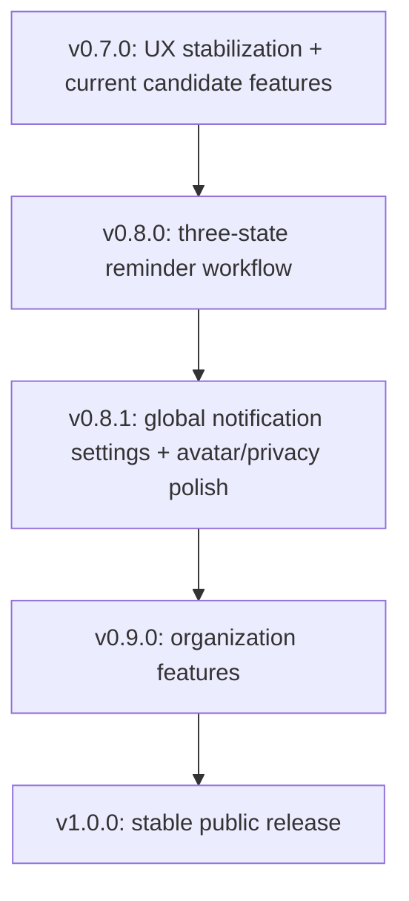

# ai-todo UX 反馈迭代计划 — v0.7.0 至 v0.8.1

日期：2026-06-09  
状态：**规划草案**；来源为 2026-06-09 内测体验反馈。  
当前基线：最新 Git release tag 为 `v0.6.2`；当前组件版本为 API `0.3.0`、CLI `0.5.0`、微信小程序 `0.6.0`。  
关联需求：[UX Issue Assessment and Product Requirements](../product/ux-issues-requirements-2026-06-09.md)

## 版本编号说明

仓库中已有 [v0.7.0-plan.md](./v0.7.0-plan.md)，但它仍是候选规划，不是已发布版本。因此这批 UX 反馈不应从 `v0.7.1` 开始。

推荐做法：

- 若 `v0.7.0` 尚未发布：把本计划的高优先级体验修复合入 `v0.7.0` 发布火车。
- 若 `v0.7.0` 已经进入不可改动的提审/发布流程：再拆出 `v0.7.1` 作为 hotfix。

当前按“`v0.7.0` 尚未发布”规划。

## 规划原则

本批反馈同时包含 bug、体验一致性、数据模型升级和 CLI 输出质量。为了降低发布风险，拆成三段：

1. **先修正明显错误引导和时间保存可信度**：这些问题直接影响用户信任，应进入下一个发布火车。
2. **再做提醒状态模型升级**：`未完成 / 处理中 / 已完成` 涉及 API、数据库、CLI、小程序、共享类型，单独作为 minor 版本。
3. **最后做设置、展示和账号体验收口**：统一通知设置、标题展示、头像和隐私协议，是体验完整度提升。

> 说明：用户与产品交互语言不在本计划中改为英文；“英文-only”仅适用于 CLI 的用户可见输出。

---

## v0.7.0：内测体验稳定版

定位：承接当前 `v0.6.2` 后的下一条发布火车。建议将原 `v0.7.0` 候选中的“小程序来源角标 + 提醒列表分组”与本批 P0/P1 体验修复合并评估。

### 目标

- 修复未登录时错误提示。
- 修复日历时间保存/显示不一致。
- 调整新建日程默认时间规则。
- 处理列表长标题一行省略，减少阅读负担。
- 视工作量合并原 `v0.7.0` 候选能力：来源角标、提醒列表分组。

### 范围

#### P0：未登录提示修复

- 小程序捕获 401/403 时，不展示原始后端错误。
- 将拼写错误的原始授权错误映射为明确登录提示。
- 推荐小程序文案：`请先登录后继续使用`。
- 修正代码、测试、文档中的授权错误拼写问题。

#### P0：日历时间保存一致性

- 新建日程默认：
  - 开始时间 = 当前账户时区时间。
  - 结束时间 = 开始时间后 1 小时。
- 保存后列表和编辑页展示必须与用户选择一致。
- 检查 `combineDateTime`、`splitIsoDateTime`、账户时区和服务端落库字段。
- 如果用户尚未手动修改结束时间，修改开始时间时自动联动结束时间为 `start + 1h`。

#### P1：标题列表展示收敛

- 小程序提醒、日历、联系人相关列表标题默认单行省略。
- CLI list 输出也做标题截断，但完整内容保留在 show/detail 或 `--json`。
- 暂不收紧数据库 255 字符限制；先增加前端输入引导。

#### P1：保留原 v0.7.0 候选能力

- 提醒列表展示来源角标。
- 提醒列表按逾期 / 今天 / 未来分组。
- 若本轮质量风险升高，可将这两项后移到 `v0.7.1`。

### 非目标

- 不引入 `in_progress` 状态。
- 不重构通知偏好模型。
- 不调整隐私协议版本存储。
- 不做大型 CLI 表格系统。

### 组件版本建议

| 组件 | 建议 |
|------|------|
| Git release tag | `v0.7.0` |
| API | patch 或不变，取决于是否修正服务端错误响应 |
| CLI | patch，因输出文案和截断变化 |
| 微信小程序 | minor 或 patch，取决于是否合入来源角标/列表分组 |
| shared packages | 如类型不变可不 bump |

### 验收

- [ ] 未登录访问受保护页面时展示登录引导，不出现原始授权错误。
- [ ] 搜索全仓无授权错误拼写问题。
- [ ] 新建日程默认结束时间为开始时间后 1 小时。
- [ ] 选择 10:00 保存后，列表/编辑页仍显示 10:00。
- [ ] 长标题在列表中单行省略，不挤占多行。
- [ ] CLI 用户可见输出为英文。
- [ ] 如合入原候选能力：来源角标和列表分组验收通过。
- [ ] `pnpm check:wechat` 通过。
- [ ] 相关 API/CLI 测试通过。

---

## v0.8.0：提醒三态工作流

定位：提醒状态模型升级版本；这是本批需求中风险最高、最值得单独发布的一段。

### 目标

- 支持工作项阶段流转：未完成、处理中、已完成。
- API、CLI、小程序展示与操作保持一致。
- 保证已有提醒数据可平滑迁移。

### 状态设计

产品态：

| 产品状态 | 建议 API 值 | 含义 |
|----------|-------------|------|
| 未完成 | `not_completed` | 尚未开始或未进入处理 |
| 处理中 | `in_progress` | 正在推进 |
| 已完成 | `completed` | 已结束 |

迁移策略：

- 现有 `pending` → `not_completed`。
- 现有 `completed` → `completed`。
- 现有 `cancelled` 暂保留为内部兼容值，用户侧优先通过删除/归档表达。

### 范围

#### P0：后端与数据迁移

- 增加状态合法值校验。
- 提供迁移脚本或兼容读取逻辑。
- `completed_at` 仅在进入 `completed` 时写入；从 `completed` 切回其他状态时需明确是否清空，建议清空。
- API list 支持按新状态过滤。

#### P0：小程序状态操作

- 提醒列表增加三段筛选：未完成、处理中、已完成。
- 提醒详情/编辑页支持切换状态。
- 快捷完成行为保留，但需要避免与“处理中”入口冲突。

#### P0：CLI 对齐

- CLI 用户可见输出全部英文。
- `reminder list --status not_completed|in_progress|completed`。
- `reminder update --status in_progress` 或新增显式命令，按现有 CLI 风格选择。
- JSON 输出保持稳定字段结构。

#### P1：兼容与文档

- 更新 agent protocol、skill、API 文档、CLI README。
- 对旧的 `pending` 查询做兼容期说明。

### 非目标

- 不做复杂项目管理看板。
- 不增加优先级、标签、负责人等新维度。
- 不做状态自动化流转。

### 组件版本建议

| 组件 | 建议 |
|------|------|
| Git release tag | `v0.8.0` |
| API | minor |
| CLI | minor |
| 微信小程序 | minor |
| shared packages | minor |
| MCP / agent protocol | 如暴露状态值则 minor 或 patch 对齐 |

### 验收

- [ ] 老数据迁移后可正常列表展示。
- [ ] 用户可将提醒从未完成切到处理中，再切到已完成。
- [ ] CLI list 和 update 支持新状态，且输出为英文。
- [ ] API 状态过滤支持三个产品状态。
- [ ] `completed_at` 行为符合定义。
- [ ] 回归今日提醒、来源提醒、删除、编辑、Agent 写入。

---

## v0.8.1：设置一致性与账号体验收口

定位：体验完整度 patch/minor；承接 v0.8.0 后统一用户心智。

### 目标

- 统一提醒和日历的通知设置。
- 修复头像偶发丢失。
- 隐私协议同版本不重复提醒。
- CLI 列表显示进一步 polish。

### 范围

#### P0：全局通知设置

- 将“微信通知总开关”“默认开启通知”“免打扰”聚合为全局通知设置。
- 明确该设置同时作用于提醒和日历。
- 日历和提醒创建页只读取同一套全局默认值。
- 若保留单项开关，文案明确为“本项覆盖全局设置”。

#### P0：头像持久性

- 微信登录或资料刷新时，如果新响应没有头像，不覆盖已有头像。
- 用户明确清空头像时才写空。
- 小程序头像渲染增加稳定 fallback。

#### P1：隐私协议版本化

- 存储用户已同意的隐私协议版本。
- 同一协议版本下，重新登录不重复弹隐私协议。
- 协议版本变化时重新触发确认。

#### P1：CLI 输出 polish

- 统一 reminder/calendar/contact/token 的列表样式。
- 保持所有 CLI 用户可见文案为英文。
- 长标题截断、状态标签、空态、错误提示统一。

### 非目标

- 不引入新的通知渠道。
- 不做多语言体系。
- 不变更微信订阅消息模板类目。

### 组件版本建议

| 组件 | 建议 |
|------|------|
| Git release tag | `v0.8.1` |
| API | patch 或 minor，取决于是否新增隐私协议版本字段/API |
| CLI | patch |
| 微信小程序 | patch |
| shared packages | 如新增字段则 patch/minor |

### 验收

- [ ] 设置页能清楚表达通知为全局设置，提醒/日历不再割裂。
- [ ] 关闭全局微信通知后，提醒和日历均不默认发起微信提醒。
- [ ] 重新登录不会导致已有头像消失。
- [ ] 同一隐私协议版本下重新登录不重复提示。
- [ ] 升级隐私协议版本后会重新提示。
- [ ] CLI 人类可读输出无中文。

---

## 后续版本候选

### v0.9.0：提醒组织能力

- 状态流转后的下一步可以考虑：优先级、标签、列表分组、搜索筛选。
- 仅当三态工作流稳定后再进入。

### v1.0.0：公开稳定版

- 登录、隐私、通知、CLI、提醒状态和日历基础体验稳定后再考虑。
- 需要补齐兼容性文档、发布回滚演练、隐私合规复核。

---

## 总体依赖关系

## 需要产品确认的问题

- `not_completed` 是否作为 API 真实状态值，还是仅作为 UI 文案，API 内部继续使用 `pending`？
- 日历是否允许用户移除结束时间？建议允许，但默认创建时带 1 小时结束时间。
- 标题限制是否采用“80 字符软提示 + 255 后端硬限制”？建议先这样做，避免破坏已有数据。
- 通知是否需要单项覆盖？建议 MVP 保留全局默认，单项覆盖后置。
